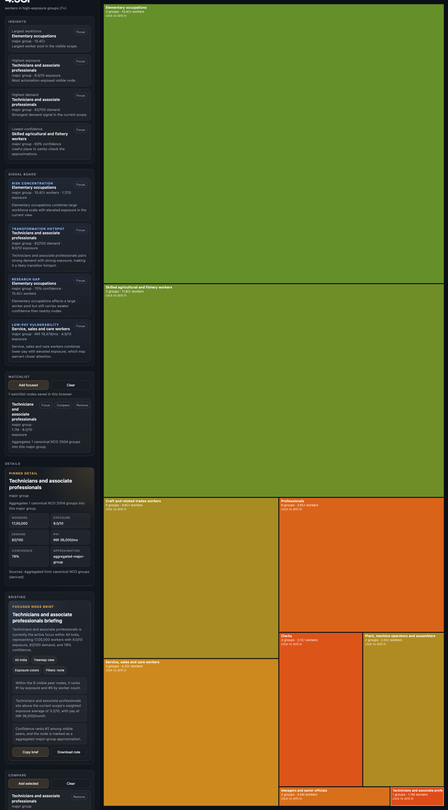

# AI Exposure of the Indian Job Market

Adapted from [`karpathy/jobs`](https://github.com/karpathy/jobs), with the same static-site shape and a rewritten India-specific labour-market pipeline based on **NCO 2004 3-digit occupation groups**.

Live demo: [laksh-star.github.io/india-jobs-ai-exposure](https://laksh-star.github.io/india-jobs-ai-exposure/)

This repository is an adaptation, not a forked continuation of the upstream project. Upstream remains Karpathy's original US-market implementation.

The repo now ships with a transparent **seed dataset** so the site is runnable without PLFS microdata or live NCS scraping. The production path is still the same 5-stage idea: build taxonomy, ingest labour stats, ingest demand, generate packets, score AI exposure, and ship a static treemap.



## Disclaimer

This project is a best-effort attempt to adapt Karpathy's original US job-exposure repo to the Indian labour market with the public and practical data sources currently available to us.

Our goal was to preserve the spirit of the original project while modifying the pipeline, schema, and scoring logic to suit Indian occupations as closely as possible. The current repository therefore combines real India-oriented structure and occupation groups with the level of PLFS, NCO, and public NCS data that is realistically available for redistribution and local experimentation.

It should be read as an India-focused adaptation and approximation, not as a final or official measurement of AI exposure across all Indian jobs.

## Status

- The default runnable build is a seed/demo India dataset.
- The production path is planned around PLFS + NCS inputs, but those raw sources are not redistributed in this repo.
- GitHub Pages deployment is configured from the `site/` directory via GitHub Actions.
- If the Pages site does not appear after the first workflow run, set the repository's Pages source to `GitHub Actions` in GitHub Settings.

## Active pipeline

The public India pipeline is:

- `prepare_india_seed.py` materializes the bundled India demo dataset.
- `build_taxonomy.py` builds the canonical `nco2004_3d` taxonomy.
- `aggregate_plfs.py` aggregates PLFS-style person-level CSV into `india/processed/plfs_aggregates.json`.
- `scrape.py` scrapes public NCS job listings or writes a seed demand snapshot.
- `process.py` writes occupation packets and Markdown pages.
- `make_csv.py` builds `occupations.csv` in the India schema.
- `score.py` scores occupation groups with an LLM or writes the bundled seed scores.
- `build_site_data.py` produces `site/data.json`.
- `validate_india_data.py` validates the generated site payload.

The active root entrypoints are India-only. Upstream BLS parsing scripts and source dumps are intentionally not part of the public surface anymore.

## Repository layout

- `india/raw/` is intentionally sparse in git and contains only redistributable seed/demo raw files.
- `india/processed/` contains generated India packets that keep the demo build runnable.
- `pages/`, `occupations.csv`, `scores.json`, `prompt.md`, and `site/data.json` are generated India outputs.
- Upstream commit history is preserved, so GitHub contributors include the original upstream authors alongside India-adaptation commits.

## Data model

The canonical join key is **`nco2004_3d`**. The site payload includes:

- `country`
- `nco2004_3d`
- `nco2015_3d`
- `employment_workers`
- `worker_share`
- `median_monthly_earnings_inr`
- `demand_index`
- `vacancies_90d`
- `exposure`
- `exposure_confidence`
- `education_mix`
- `rural_urban_split`
- `sources`

## Seed demo

This is the fast path for a working local build:

```bash
uv run python prepare_india_seed.py
uv run python process.py --seed
uv run python make_csv.py
uv run python score.py --seed
uv run python build_site_data.py
uv run python make_prompt.py
uv run python validate_india_data.py
cd site && python -m http.server 8000
```

The seed bundle is intentionally explicit about its status:

- Occupation groups are real NCO-style groups.
- Labour counts, pay, and demand are seed approximations.
- `sources` and confidence fields stay visible in the site payload.

## Production pipeline

Use these source baselines for a fuller build:

- PLFS 2023-24 person-level microdata or an exported CSV with `nco_2004_code`, `person_weight`, `monthly_earnings_inr`, `education_bucket`, and `rural_urban`
- NCO 2004 / NCO 2015 crosswalk and title tables
- Public NCS job-search listings
- NCS career information / occupation-detail text

Suggested flow:

```bash
uv run python build_taxonomy.py --from-csv india/raw/nco_3d.csv
uv run python aggregate_plfs.py --input india/raw/plfs_person_level.csv
uv run python scrape.py --pages 10
uv run python process.py
uv run python make_csv.py
uv run python score.py
uv run python build_site_data.py
uv run python validate_india_data.py
```

`process.py` and `make_csv.py` currently default to the seed bundle when richer upstream files are not present. That keeps the repo runnable while leaving room for the real PLFS + NCS ingestion path.

See `india/raw/README.md` for the expected raw filenames, source-acquisition notes, and what is intentionally not checked into the repo.

## Setup

```bash
uv sync
uv run playwright install chromium
```

Optional live rescoring via OpenRouter requires:

```bash
OPENROUTER_API_KEY=your_key_here
```

The default seed/demo flow does **not** require an API key. You only need `OPENROUTER_API_KEY` if you want to run `score.py` without `--seed` and generate fresh LLM exposure scores.
